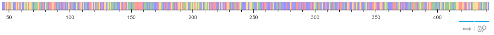
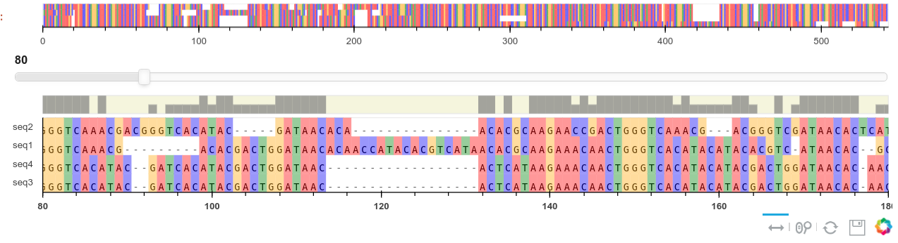
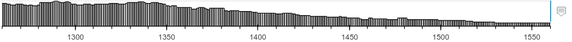
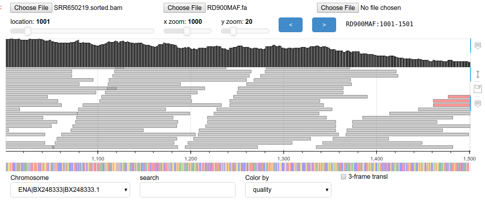

Usage
=====

This toolkit is to provide bioinformatic visualization tools to be used inside Jupyter notebooks.

Installing the package provides the command pybioviz at the terminal. This can be used to launch the various tools.

Code examples
=============

Imports
+++++++

.. code-block::

  import panel as pn
  import panel.widgets as pnw
  pn.extension()
  import pybioviz as pbv

View a sequence
+++++++++++++++

A trivial usage is to display a piece of sequence from a fasta file. This is usually useful used in conjunction with other widgets.

.. code-block::

  fasta_file='genomes/cow/ARS-UCD1.2/ars-ucd1.2.fa'
  seq = pbv.get_fasta_sequence(fasta_file, 1400, 1800, key=0)
  out = pn.pane.Bokeh()
  out.object = pbv.plot_sequence(seq, xaxis=False)

.. code-block::

  out.object = pbv.plot_sequence(seq, tools='xpan,xwheel_zoom'))

Plot sequence alignments
++++++++++++++++++++++++

A sequence alignment can be plotted by reading in an alignment in fasta, clustal or other format. The BioPython package is used to read the file and the alignment records passed to the plot function.

.. code-block::

  from Bio import AlignIO, SeqIO
  aln = AlignIO.read(aln_file, 'fasta')
  out = pn.pane.Bokeh()
  out.object = pbv.plot_sequence_alignment(aln,plot_width=1000)

Plot bam coverage
+++++++++++++++++

.. code-block::

  cov = pbv.get_coverage('file.sorted.bam','chrom',1460,1860)
  out = pn.pane.Bokeh()
  out.object = pbv.plot_coverage(cov)

Plot genome features
++++++++++++++++++++

Genomic features describe the annotated sequence in a genome such as proteins, rnas etc. These can be read from multiple formats: gff, genbank.

.. code-block::

  feats = pbv.genbank_to_features('Mbovis-AF212297.2.gb')
  out = pn.pane.Bokeh()
  out.object = pbv.plot_features(feats,preview=False, plot_width=900, plot_height=80)

Plot vcf
++++++++

vcf and bcf files are the results of variant calling programs. These are coordinates along the reference sequence and variant details.

Viewers (Dashboards)
====================

Viewers are mini apps that are created by using the plotting tools detailed above, combined with widgets that allow user interactivity. They can be created inside a notebook or launched as standalone apps in a web browser using a command in the terminal.

Sequence alignment viewer
+++++++++++++++++++++++++

This dashboard is for used for viewing and manipulating multiple sequence alignments.

Bam alignment viewer
++++++++++++++++++++

Bam files are used to store the results of short reads aligned to a genome sequence. Since there are often millions of reads aligned, the bam files must be sorted and indexed before viewing. This then allows arbitrary chunks to be read from any location quickly. Often this is called 'random access' to the file. IGV is a popular browser for bam alignments. Usually the reference sequence is also needed.

